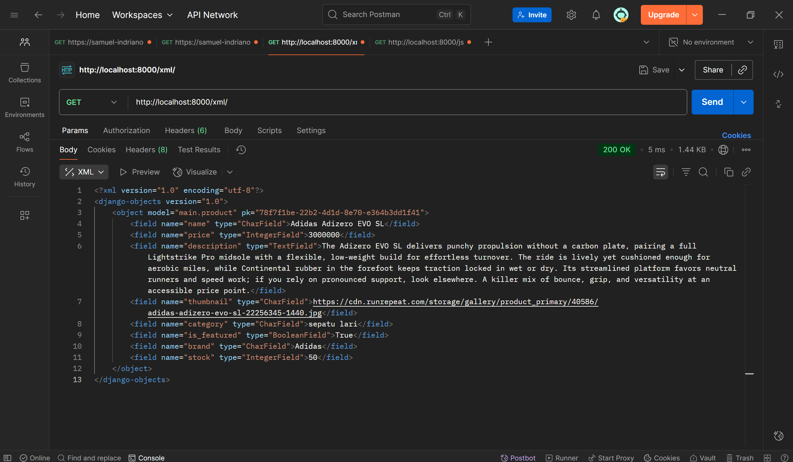
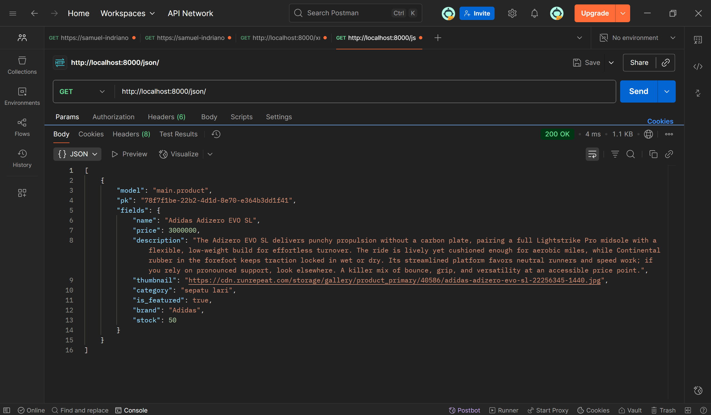
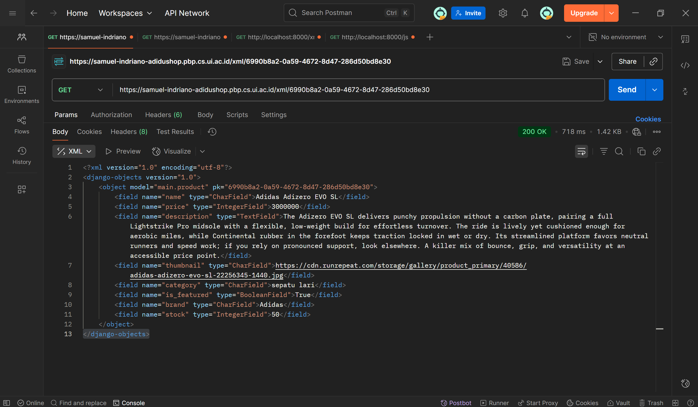
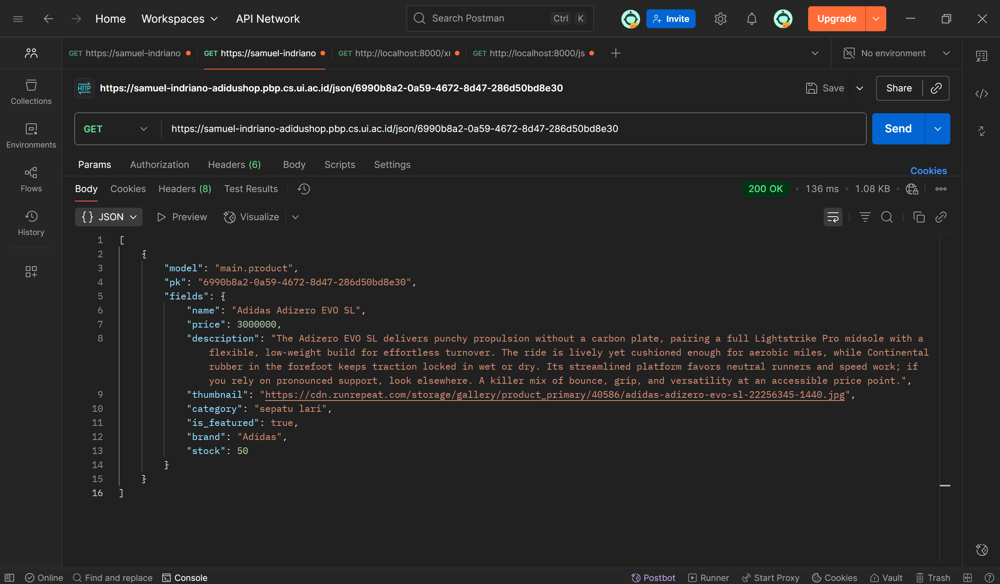
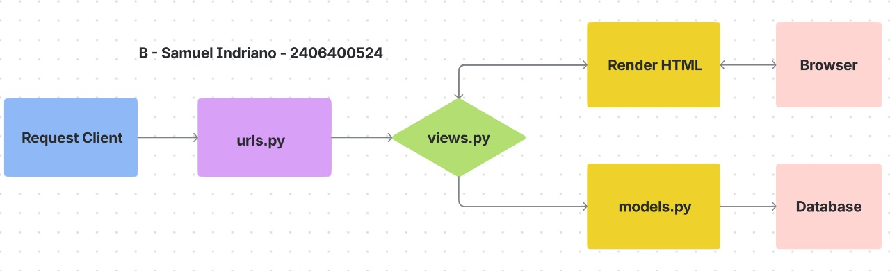

Nama : Samuel Indriano
NPM : 2406400524
Kelas : B
## TUGAS 4
1. Apa itu Django AuthenticationForm? Jelaskan juga kelebihan dan kekurangannya.

2. Apa perbedaan antara autentikasi dan otorisasi? Bagaiamana Django mengimplementasikan kedua konsep tersebut?

3. Apa saja kelebihan dan kekurangan session dan cookies dalam konteks menyimpan state di aplikasi web?

4. Apakah penggunaan cookies aman secara default dalam pengembangan web, atau apakah ada risiko potensial yang harus diwaspadai? Bagaimana Django menangani hal tersebut?

5. Jelaskan bagaimana cara kamu mengimplementasikan checklist di atas secara step-by-step (bukan hanya sekadar mengikuti tutorial).

## TUGAS 3
1. Data delivery penting karena kita bisa mengakses data secara langsung, menjamin akurasi data, mendeteksi adanya error, hingga validasi data.

2. JSON lebih baik daripada XML karena JSON lebih mudah di parse dibanding XML dengan JavaScript object. JSON juga lebih populer karena lebih simpel untuk ditulis dan dibaca, lebih ringkas, dan bisa make array.

3. is_valid() pada form Django berawal dari form yang menjalankan proses validasi, seperti validasi input user, validasi model, cleaning data, dan beberapa proses lainnya. Jika proses validasi nya berhasil dilewati, maka is_valid() akan return True, jika gagal maka akan return False dan error akan dikirim pada form.errors. is_valid() dibutuhkan untuk melakukan banyak proses validasi, cleaning data, memberi feedback error, dan membuat validasi yang reusable tanpa harus implementasi manual di view.

4. Kita membutuhkan csrf_token untuk menjamin request datang dari user asli yang sedang login dan bukan dari request berbahaya yang dikirim penyerang. csrf_token bekerja dengan menambahkan token unik yang terdiri banyak karakter random, sehingga sulit untuk ditebak penyerang. Jika tidak ada token, penyerang dapat dengan mudah mengirim request palsu yang tidak kita ingingkan. Pengiriman request biasanya dilakukan penyerang melalui website berbahaya, dimana penyerang bisa menyisipkan request pada browser pengguna. Request juga akan dikirim bersama cookie dari browser pengguna ke server tujuan, sehingga terlihat seperti pengguna asli yang melakukannya.

5. Checklist 1: Pertama, saya mengimport yang dibutuhkan, yaitu HttpResponse dan serializers. Kemudian saya membuat fungsi show_xml, show_json, show_xml_by_id, dan show_json_by_id.

Checklist 2: Kemudian mengedit urls.py, yaitu dengan menambahkan import dari keempat fungsi tersebut dan juga menambahkan path url agar keempat fungsi yang sudah di import bisa diakses.

Checklist 3: Pertama, tambahkan dulu function create_product dan show_product di views.py. Tidak lupa juga untuk menambahkan path url di urls.py dari kedua fungsi tersebut. Kemudian baru memodifikasi main.html dengan menambahkan button dan juga loop agar bisa menampilkan semua produk yang sudah ditambahkan. Lanjut membuat create_product.html untuk menampilkan halaman input product.

Checklist 4: Saya membuat forms.py dan mengisinya dengan kode yang diperlukan, yang nantinya akan digunakan untuk menerima input data product dari pengguna. Kemudian saya mengimport ProductForm di views.py dan memodifikasi dictionary pada function show_main agar bisa menampilkan data product secara otomatis.

Checklist 5: Terakhir, saya membuat product_detail.html yang akan menampilkan halaman berisi detail dari setiap product. Kemudian menambahkan url project pada CSRF_TRUSTED_ORIGINS di settings.py.

6. Tidak ada

7. Screenshots:

## TUGAS 2
Tautan PWS: https://samuel-indriano-adidushop.pbp.cs.ui.ac.id/

1. Checklist 1: Pertama bikin direktori baru bernama "adidu-pbp". Kemudian inisiasi repo baru dengan "git init". Selanjutnya saya buat repo baru "adidu-pbp" di GitHub. Lanjut saya menghubungkan repo lokal dengan repo yang di github dan melakukan clone repo github ke VS Code.

Lanjut bikin venv dan mengaktifkannya, kemudian menambahkan dan modifikasi syarat" yang diperlukan seperti pada "requirements.txt", ".env", ".env.prod", dan "settings.py", baru akhirnya bisa di migrate dan berhasil membuat proyek django.

Checklist 2: Pada terminal yang sudah teraktifkan venv, jalankan "python manage.py startapp main" untuk membuat aplikasi main.

Checklist 3: Saya add "main" dalam list bernama installed apps di settings.py dari direktori adidu_shop agar aplikasi "main" terdafatar di proyek.

Checklist 4: Selanjutnya saya membuat model dengan membuat class Product di models.py. Class tersebut berisi atribut seperti name, price, description, thumbnail, category yang merujuk pada list "CATEGORY_CHOICES" untuk pilihan produk, is_featured, brand, dan terakhir stock.

Checklist 5: Memodifikasi views.py dengan membuat function bernama "show_main" yang nantinya akan berisikan dictionary dengan key npm, nama, dan class. main.html juga tidak lupa di modif dengan template variables. Terakhir, kembali pada views.py yang di akhir akan return render untuk request http, dan menampilkan berkas html sesuai dengan data yang diteruskan dari dictionary.

Checklist 6: Pertama untuk konfigurasi routing pada URL aplikasi main, urls.py di direktori main dilakukan import path dan show_main. Kemudian buat list yang isinya berupa function path, untuk mendefinisikan pola URL.

Kedua untuk konfigurasi routing pada URL proyek, urls.py di direktori adidu_shop dilakukan import path dan include, kemudian ditambahkan juga list yang isinya berupa function path.

Checklist 7: Lakukan migration dulu dan commit semua perubahan. Baru di terminal ketik "git remote add pws https://pbp.cs.ui.ac.id/samuel.indriano/adidushop" dan kemudian "git push pws master". Terakhir tinggal buka "https://samuel-indriano-adidushop.pbp.cs.ui.ac.id/" dan selesai!

2. 

3. File yang berisi seluruh konfigurasi aplikasi kita. Mulai dari pengaturan keamanan app, pengaturan database, dan masih banyak lainnya.

4. "makemigrations" akan membuat migrasi baru dari semua perubahan pada model, kemudian dilanjut "migrate" untuk menambahkan migrasi tersebut ke dalam database.

5. Django menggunakan arsitektur MVT, sehingga kode lebih mudah untuk diorganisir dan dijaga. Kemudian django juga memiliki object-relational mapping (ORM) sehingga bisa langsung connect ke database hanya dengan kode Python. Django juga menggunakan Django Template Language yang bisa mengirim data dari backend ke html dengan syntax sederhana.

6. Tidak ada